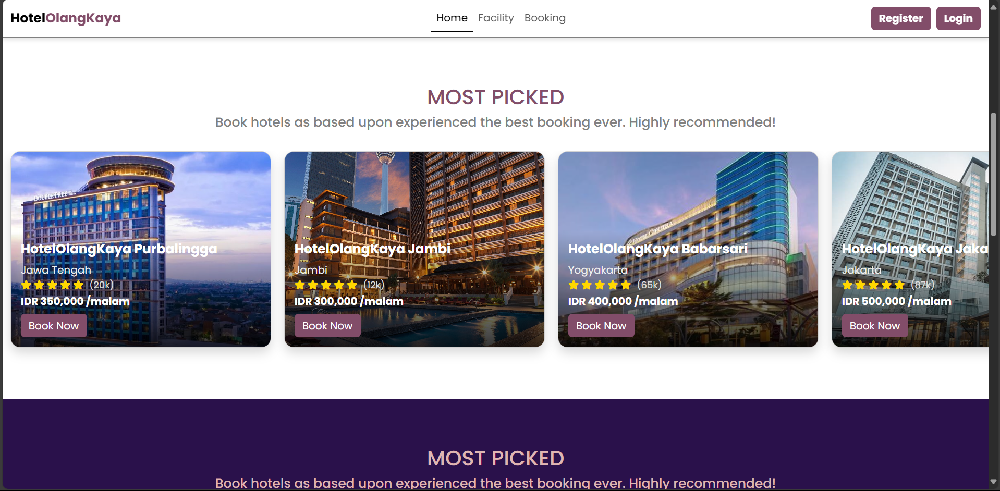

# Hotel OlangKaya Website

## Created By
- Eric Daniswara Octa Wijaya
- Febry Simahan
- Rizky Amalya Putri
- Jessika Hana Victoria

## 📸 Tampilan Halaman

### 1. Autentikasi & Beranda

  

    
Login Page

    
  

  

    
Home Page 1

    
  

  

    
Home Page 2

    
  

---

### 2. Booking & Pembayaran

  

    
Booking Page

    
  

  

    
Booking Confirmation

    
  

  

    
Payment Page

    
  

  

    
Unpaid Page

    
  

---

### 3. Admin Dashboard & Manajemen

  

    
Dashboard Admin

    
  

  

    
Facility Management

    
  

  

    
Master Data

    
  

  

    
User Management

    
  

